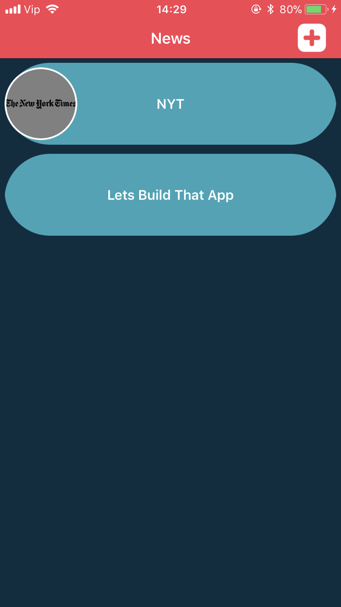
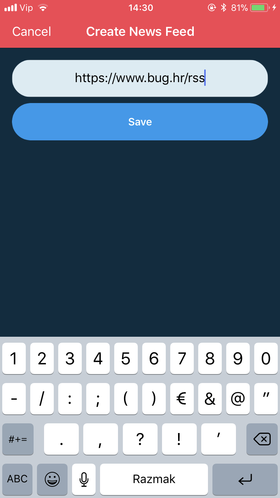
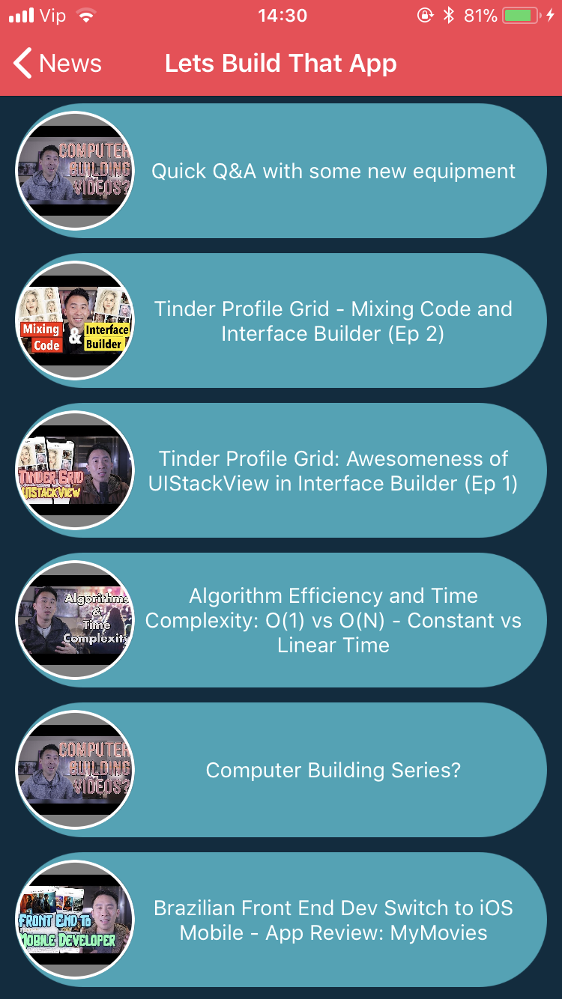
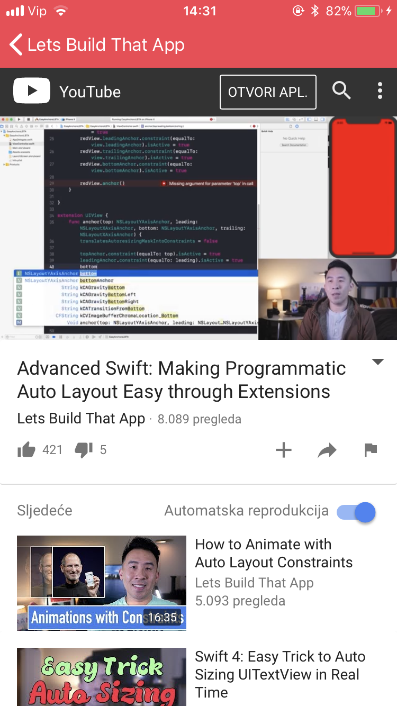

# RSS Reader

 RSS reader app in Swift 4. Based on fetching XML content, parsing and showing details to user.
#
RSS feeds screen:
- Shows a list of RSS feeds
- Selecting a feed shows connected stories
- Created screen from code with auto layout support
- Add new feed

   
 
#
RSS stories screen:
- shows a list of RSS stories for the selected feed
- story should consist of name and image (if available)
- selected story opens in UIWebView
- using Storyboard with auto layout support

   
 
#
Core Features:
- autoLayout with code and in Storyboard
- parsing XML
- persistant storage (CoreData)
- cashing images
- alertNotifications

